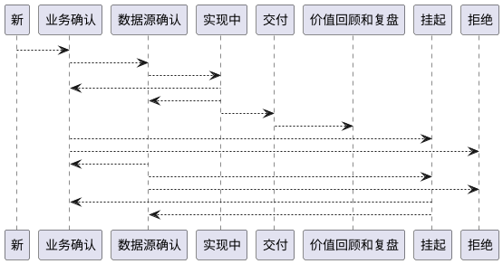

本篇关键内容（阅读需要约 15 分钟）：

1. 分析师的职责范围
2. 重定义：数据科学合作伙伴
3. 数据需求的标准流程
4. 工欲善其事，必先利其器 - tapd

为什么写这篇文章？起因是分析师团队的 leader 离职了，作为大老板，我只能选择暂代管理一段时间。在帮团队成员梳理工作内容的过程，我抽象了其中一些关键的要素，以及需要澄清的认知误区。这些总结我不想仅仅封闭在自己的团队内部，还希望能帮到正在职业生涯迷茫的分析师们。

<!-- more -->

# 1. 分析师的职责范围

为了说清楚为什么会有后面这么庞大的逻辑体系，需要从分析师处理的主要三种类型工作说起：

1. 临时性数据需求（或专项分析报告）
2. 快速可视化报表开发（BI）
3. 专业角度的数据挖掘任务

几乎所有人都希望承担第 3 种类型工作。为什么呢——无外乎，节奏更主动，复杂度高，彰显个人的专业价值呗。第 1 和 2 种工作往往被贴上了被动、低价值、重复劳动这些标签。先别急着下结论，这个观点背后是因为不匹配的认知和流程而导致的，如果 1 和 2 不能正确的搞定，你会因为不懂业务，也不可能玩转这些所谓的专业数据挖掘任务的。

在聊正事之前先分享一个故事，故事的名字叫做《第 7 个馒头》，情节很简单：

> 有个老头儿饿坏了，一连吃了 6 个馒头还没吃饱，当他吃下第 7 个馒头时，终于吃饱了。
>
> 于是好事者开始研究第 7 个馒头的做法和用料，想从中挖决出老头吃饱的奥秘……

这个故事周鸿祎经常挂在嘴边，虽然听起来像笑话，但实际上每天都在重复上演。想想我们在教科书、外部分享看到或听到的拍案叫绝的案例，它们都在讲第 7 个馒头。我们所有的分析训练（并不是特指狭义的数据分析）都在指向研究第 7 个馒头的做法和用料，而忽视了前 6 个馒头的过程和作用。

“凡战者，以正和，以奇胜”，一定要谨记：“正和”是在“奇胜”之前。临时性数据分析需求就是前 6 个馒头，恰恰可以让分析师全方位、深入理解业务问题，是极佳的契机点！

核心点说清楚了，那如何解构呢？我们需要从角色定位、环节内容、机制等环节来重塑流程。

# 2. 角色定位和机制

传统上，我们一般定义了数据分析师、数据分析专员这两个角色。但仔细想想这两个名词的字面意义，问题其实非常大，他们居然全是面向数据的，而不是面向业务问题或者价值本身的！

更恰当的定义是什么呢？在我的团队，我把她重新定义成了 DSP（Data Science Partner），是披着数据科学外衣的合作伙伴。不要小看这个角色定义的不同，这个角色要求数据分析师从一个被动接受需求的定位直接过渡到合作者模式。（为了保持行文和观念的一致性，后面依然会使用数据分析师的称呼）

输出决定于输入。角色重新定义之后，分析师如何获得更多的信息？如果不能够第一时间获取公司的决策信息，那么工作还是会非常被动。不同的公司有不同的操作方法，这里面给出建议的操作步骤：

1. 利用好列席其他部门的周例会的机会。既然定义为 partner，那么伙伴部门的周例会必须要全程参加，以伙伴视角观察这个部门日常运作的情况，不超过一个月，分析师会在目标认知上有长足变化。
2. 利用非工作时间（如午餐）同伙伴部门的关键人物进行一对一非正式沟通，并持续保持频率。
3. 以上信息定期同数据部门老大做更新，得到反馈。

以上动作释放给了外部一个信号，我们可以一起通过数据搞定业务问题，在有需要的第一时间马上可以找到数据分析师。在有效信息输入问题得到改善之后，分析师将面临接到需求之后如何更高效率的整合这些零散。**整合的效率和 1 年之后的分析师价值高度相关。**

注：（对于我司来说）分析师负责的十条业务线分别是：CEO、市场、运营、外教、产品、学术、用户体验、技术，财务，人力。

# 3. 数据分析的工作流程

> 数据分析工作最终指向的是，通过业务问题的拆解和合并，最终形成业务问题图谱。

先针对于单一分析任务，我把这个数据分析师的工作流程划分成了八个状态，这些状态（环节）的简要介绍如下：

"新" 这个状态是起始状态，"已拒绝" 和 "价值回顾和复盘" 这两个状态是结束状态。我们逐个分析为什么在数据分析的过程中必须要这些环节？

## 3.1. 环节：新

这个状态是不做任何评判，纯粹从需求方角度，忠实的记录原始需求。这里只是纯粹的记录，而不进行 judgment，这里借鉴了ORID 焦点讨论法的第一个步骤，其中的奥妙请自行思考。

## 3.2. 环节：业务确认

这个环节是分析师显示自身的专业能力的关键环节，也是分析任务成败的首要关键步骤。由于需求方背景不同，对于数据认知能力也参差不齐。这里面会存在几种可能：

1. 业务方无法描述问题
2. 业务方将很多问题混杂在一起
3. 业务方清楚面临问题，但无法和数据进行映射
4. 业务方清楚面临问题，提出了错误的数据需求
5. 业务方无法预判可能的分析结果

对于 1 类需求方，专业技能不合格，会祸害上下游，fire 掉就可以了，**绝对不可以手软。**（如果你是我的分析师，请告诉我这个业务是谁）

对于 2 类需求方，非常普遍，因为很多人并没有经受过严格的系统化思维，分析师需要使用 MECE 原则帮助业务方梳理业务，在期间找到机会点。同时在梳理问题的同时，需要了解清楚什么是主要问题，什么是次要问题？什么是问题背后的问题？

对于第 3 类需求方，也相对普遍，一般企业是通过角色前置来缓解这个问题，通常这个前置的角色是产品经理，不过悲剧的是前置角色可能不合格，这时又需要分析师在~数据源确认~环节给出专业建议。

第 4 类业务方的问题和第 3 种很像，但需要单独提出来，想想一下，对方提了一个错误的数据需求，但作为分析师的你居然漂亮地执行完成了……然后业务方不满意，又提了一遍，可能还有第三遍……新手分析师应该没少吃过这个哑巴亏。

对于第 5 类，我们实际上对业务方提出了更高的要求，这背后的逻辑有两层：

- 业务方是否游刃有余的掌控业务和数据之间的所有可能关系；
- 如果有和预期一致的数据分析结果，那么接下来的行动方案是否值得执行。

**如果以上两点业务方把控的非常完美，不论你是否是资深数据分析师，赶紧抱大腿！**如果大腿不知道怎么抱，私信我。

## 3.3. 环节：数据源确认

这个环节可能会有以下几个问题：

1. 期望的数据在技术层没有存储
2. 有数据，但数据分散在数据仓库的不同位置

第 1 个问题在初创公司比较常见，第一责任人是研发，顺次是产品经理，再次是业务方。如果作为分析师搞定了这个数据源问题，你实际在变相帮助产品经理和业务方，甚至是研发。久而久之，你的技术层面影响力会得到持续强化。

第 2 个问题体现了数据仓库设计的不完备。这种情况下，首先判断是否是经常性问题，如果不是，临时解决即可；如果是，有两种策略：

1. 告知数据仓库开发对应负责人，等待预期数据结果的交付；
2. 主动了解底层的数据逻辑，在 ODS 层做二次处理，在临时数据层形成结果集，最终将工程化的代码交付数据仓库团队。

考虑到分析师团队一般同仓库团队隶属于同一个大部门，持续保持这个习惯，也会增强分析师的内部影响力。

## 3.4. 环节：实现中

这个步骤需要强调的点是如何利用 git 管理好自己的分析代码，以 R 为例，尽量使用 `magrittr`、`dplyr`、`dtplyr` 这类的包，保证数据处理的每个步骤的可读性。同时保证代码内的注释以及 git commit 的信息完整性。

分析师会通过 HIVE SQL 提取数据，再通过 R 进行处理，如何设计取数逻辑，利用好 HIVE SQL 和 R 两种工具的各自优点，提高数据处理的可理解性和速度，考验的就是基本功了。

这里多讲一下工具的使用，如果大量使用 R Notebook 这类工具，会让你的效率大大提高。

## 3.5. 环节：交付

强调无数次：

> 从数据到结论！

如果分析师没有结论则不能称之为交付。交付的形式有文档、幻灯片、邮件，不同交付形式会有一些不一样的要求，对于分析师来说幻灯片交付要求最高。未来可能会专门写篇文章来讲述如何做幻灯片（注意 slides 不等于 PPT）。

交付的内容从要素上来说包含文字、表格、图形。文字内容部分是在业务确认环节中梳理的逻辑深度，表格也不详细赘述，在分析的过程如何确定一张合理的图形呢？这里面有一些套路，偷懒了，直接给出一个前人总结的经验：

## 3.6. 环节：价值回顾和复盘

1. 初级分析师经常会在这个环节出现失误，我经常在 review 各位分析师项目时会发现，很多项目会停滞在~交付~这个环节，习惯的力量太可怕。这个环节的两个关键点：价值的判断和复盘。

   价值判断至少存在两方面考量：

   1. 通过分析得到的关键正确决策，影响公司某项进程的直接价值。锻炼的是分析师业务 sense 能力；
   2. 个人有限的时间带来的收益，投入产出比。锻炼的是分析师时间规划能力和判断力。

复盘（After Action Review）这个话题很大，在这个节点我们稍稍聚焦一下：

1. 为什么和初始的目标相差很远？关键的事件是什么？
2. 重新做一遍这个需求，哪些行为需要开始做？那些事情需要停止做？哪些事情需要持续做？
3. 以上不限于技术、流程、环境、组织、人员的一切因素。

## 3.7. 状态的流转

已拒绝和挂起两种状态不做更多的赘述。最后我们再看看这 8 个状态的流转关系：

以上描述的是一个数据需求的状态定义和流转过程。反复多轮之后，分析师必须通过问题的分解和合并技巧，以及价值排序判断，形成自己的业务知识图谱，这项能力是不可复制的，切记！

# 4. 利其器

好记性不如烂笔头，上述道理大家似乎都明白，但真正在执行的时候，很多人会犯错误。强烈分析师团队利用好公司级的项目管理（敏捷开发）工具，比如我们正在使用的 tapd，或者 jira 这些都可以。

拿 tapd 来说，可以自定义 workflow，标签，包括消息等，实在太方便。除了记录数据分析需求，tapd 还可以帮我们记录平时分析师内部自行发起的需求，比如前文一笔带过的数据挖掘任务或专项分析。

以及 R 是做数据分析最好的工具，没有之一，不接受反驳

最后我们再总结一下前面的内容：数据分析师如果希望在职场生存的舒适，角色越来越关键，一定要注意创造好有利的信息输入环境，要么自己行动，要么对老板提要求；在工作职责范围，做好自己的预期管理，分析师的工作不是一锤子买卖，需要统筹好工作的层次和先后顺序；在每个分析需求的完成都要通过前面提到的 8 步法，反复锻炼自己抽象和结构问题的能力。

相信，各位分析师会玩的越来越开心。
