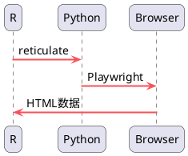

# 0. 引言：网页自动化工具的演进

十多年前，我在京东参与推荐系统研发时，每次功能上线都伴随着繁琐的回归测试。那时，测试团队使用 Selenium 框架来验证网站上的推荐模块是否正常工作。作为一款浏览器自动化工具，Selenium 能够模拟用户在浏览器中的各种操作——点击按钮、填写表单、滚动页面，然后获取验证数据。这个框架极大地提升了回归测试的效率，将我们从重复的手工操作中解放出来。

令人欣喜的是，Selenium 不仅能与 Python 完美配合，还能通过 RSelenium 包与 R 语言深度集成。这意味着我们可以在熟悉的 R 环境中直接操控网页，同时充分利用 R 语言在数据处理、统计分析和可视化方面的强大能力，形成一个完整的数据采集与分析闭环。

<!-- more -->

然而，在实际工作中我们发现，虽然 Selenium 功能强大，但在某些场景下可能显得"重"了一些。特别是在我们只需要进行简单的网页数据抓取时，更轻量级的工具往往更加高效。这就引出了 R 语言生态中的另一个优秀工具——rvest。

在 R 语言的丰富生态中，Hadley Wickham 开发的 rvest 包无疑是静态网页抓取的优秀解决方案。它采用直观的管道操作方式，让网页数据的抓取和解析过程变得优雅而高效：

```r
library(rvest)
page_data <- read_html("https://example.com") %>% # 读取网页内容
  html_elements(".product") %>% # 选择所有类名为 "product" 的元素
  html_text() # 提取元素的文本内容
```

然而，rvest 在处理现代 Web 应用时面临着一个明显的局限：对 JavaScript 渲染的动态网页支持不足。当面对单页面应用或大量依赖前端渲染的网站时，经常会出现数据抓取为空的情况，迫使我们花费大量时间分析隐藏的 API 接口。

此时，回归到模拟用户操作的思路显得更加可靠。但技术总是在进步——考虑到 Selenium 作为 2004 年诞生的框架，经过调研，我发现了更先进的替代者：微软在 2020 年推出的 Playwright。这款现代网页自动化工具在易用性、性能和功能方面都带来了显著提升，为我们提供了新的选择。

| 特性 | Selenium | Playwright |
| :--- | :--- | :--- |
| **架构协议** | WebDriver协议（W3C标准） | DevTools协议 |
| **执行速度** | 较慢（通过WebDriver代理） | **更快**（直接浏览器通信） |
| **安装配置** | 需下载管理WebDriver | **开箱即用**，自动下载浏览器 |
| **录制功能** | 依赖第三方工具 | **内置代码生成器** |
| **移动端测试** | 通过Appium | **内置**移动端模拟和真机支持 |
| **自动等待** | 需显式编写等待逻辑 | **基于元素检查的自动等待** |
| **多标签/域** | 支持但操作繁琐 | **原生支持**，易于管理 |
| **网络拦截** | 支持但实现复杂 | **强大简单**，可 Mock API |

在实际使用过程中，Playwright 的几个特性让我印象深刻：

- 极简的安装体验：两条命令就能完成所有环境配置，包括浏览器的自动下载，相比 Selenium 复杂的环境搭建要便捷得多
- 智能的等待机制：内置基于元素状态的自动等待，无需手动编写复杂的等待逻辑，大大简化了脚本编写
- 完善的 Cookies 管理：提供直观的 Cookies 操作接口，在处理需要登录的网站时格外实用

可能有读者会问：既然 Playwright 原生支持 Python，为什么还要选择 R 语言？这里涉及到技术选型的思考：Python 在 Web 自动化和爬虫领域确实强大，但 R 在数据科学领域，特别是统计分析和可视化方面，有着独特的优势。通过 R 的 reticulate 包调用 Python 的 Playwright 库，我们实现了最佳的技术组合：既能够利用 Playwright 强大的浏览器自动化能力应对任何动态内容抓取，又能够发挥 R 语言在数据分析和可视化方面的专业优势，在统一的工作流中完成从数据采集到深度分析的全过程。



这个流程帮我们实现了 “采集-清洗-分析-可视化-报告”端到端的解决方案：

- 采集：Playwright 解决动态内容抓取难题。
- 清洗与分析：利用 R tidyverse 套件（如 dplyr, tidyr）进行高效数据清洗和统计分析。
- 可视化与报告：使用 ggplot2 制作出版级图表，并通过 RMarkdown/Quarto 生成包含代码、结果和文字说明的动态报告。

通过本文，你将学到：

1. 如何在 R 中通过 reticulate调用 Playwright
2. 使用 Playwright 进行网页导航、元素定位和数据提取
3. 处理动态加载、iframe 和用户登录等复杂场景
4. 掌握自动化脚本的最佳实践和调试技巧

# 1. 环境搭建

环境配置：

- 确保系统已安装 Python（>=3.8）和 pip3。
- R 环境中 `reticulate` 已安装。

安装 playwright 库，并安装依赖的浏览器。只需要在命令行下执行：

```
# 安装 Playwright 及其依赖
pip3 install playwright
# 或者使用以下命令安装测试版本
pip3 install pytest-playwright
# 安装 Playwright 自带的 Chromium、Firefox 和 WebKit 浏览器
playwright install
```

所需要环境全部就绪。

# 2. 第一个 Playwright 脚本

先从一个最简单的示例开始。这个示例包含了以下几个关键步骤。

>启动浏览器 -> 创建页面 -> 跳转到网址 -> 截图 -> 关闭浏览器

对应的 R 代码如下：

```r
library(reticulate)
## 如果需要，切换你电脑中的 Python 环境
use_python("/Library/Frameworks/Python.framework/Versions/3.13/bin/python3")
playwright <- import("playwright.sync_api")
## 初始化 Playwright
p <- playwright$sync_playwright()$start()
## 启动浏览器（设置为非无头模式以便看到效果）
browser <- p$chromium$launch(
  headless = FALSE,  # 设置为 TRUE 则无界面运行
  slow_mo = 500     # 减慢操作速度，便于观察
)
# 穿件并打开一个新的（空）页面
page <- browser$new_page()
url <- 'https://www.baidu.com'
## 跳转到网址
page$goto(url)
## 在给定的目录下保存截图
page$screenshot(path = "example.png")
browser$close()
```

在逐行执行者十几行代码的过程，你会发现浏览器被打开，并且自动跳转到了百度首页。同时，在工作目录下生成了一个名为 `example.png` 的截图文件，最后浏览器被自动关闭。

恭喜你，完成了你第一个 Playwright with R 的脚本！虽然简单，但是它展示了 Playwright 基本操作浏览器的能力，是不是有点小兴奋？

# 3. 核心技能与实战演练

## 3.1 元素定位与提取数据

在网页自动化中，精准定位元素是获取数据的关键。Playwright 提供了强大的元素定位功能，主要通过 CSS 选择器和 XPath 来找到目标元素，然后提取其文本内容或属性值。

Playwright 主要提供以下三个核心函数进行元素操作：

- `page$query_selector(selector) / page$query_selector_all(selector)`：定位单个或多个元素
- `element$text_content() / element$inner_text()`：提取元素的文本内容
- `element$get_attribute(attr_name)`：获取元素的特定属性值

如果你对 CSS 不熟悉的话，强烈建议学习下这个可视化[教程](https://flukeout.github.io)，或者参考 mozilla 的官方教程[MDN Web Docs](https://developer.mozilla.org/en-US/docs/Web/CSS/Guides/Selectors)。以及帮助你自动化选择元素的工具[Selector Gadget](https://selectorgadget.com)，它可以帮你精准的找到你要的元素位置。

假如我们要获取百度热榜里面的所有标题信息，我们可以先使用 Selector Gadget 工具来找到这些元素的 CSS 选择器。

- 访问 [百度热榜](https://top.baidu.com/board?tab=realtime)。
- 打开 Chrome 扩展 Selector Gadget。
- 点击 Selector Gadget 工具中的“选择元素”按钮。
- 鼠标点击页面你要抓取的元素上，会自动显示对应的 CSS 选择器。例如，`.title_dIF3B` 就是内容块的选择器。


定位到所有标题元素后，我们可以使用 `page$query_selector_all(selector)` 函数来获取所有匹配的元素（是个 list）。然后，利用 `sapply` 函数和 `inner_text()` 方法提取每个元素的文本内容。

```r
## 继续前面的案例
browser <- p$chromium$launch(
  headless = FALSE,  # 设置为 TRUE 则无界面运行
  slow_mo = 500     # 减慢操作速度，便于观察
)
page <- browser$new_page()
url <- 'https://top.baidu.com/board?tab=realtime'
page$goto(url)
## 获取所有标题元素的文本内容
page$query_selector_all(".title_dIF3B") |> # 获取所有链接元素
    sapply(function(x) x$inner_text()) |> # 提取内部文字
    stringr::str_remove('\n[热沸爆新]$') # 踢掉多余新闻属性词
## 通过获取链接属性提取热门内容
page$query_selector_all(".title_dIF3B") |> # 获取所有链接元素
    sapply(function(x) x$get_attribute("href")) |>
    URLdecode() |> # 对链接进行 URL 解码
    str_extract("(?<=wd=)[^&]+") # 提取搜索关键词
```

代码运行下来即可得到我们要的标题信息。

```r
 [1] "指引法治中国建设 总书记这样阐述"    "中方回应中日官员磋商：当然不满意！"
 [3] "49.1万张飞日本机票被取消"           "全运会百米冠军首次属于“00后”"      
 [5] "矢野浩二发文：永远支持一个中国"     "中方穿五四青年服见日本官员"        
 [7] "日本民众用中文高喊高市早苗下台"     "上海进男团决赛 樊振东将再战王楚钦" 
```

## 3.2 处理交互元素

利用 Playwright 提供的 API 进行元素交互，包括点击、输入文本、等待元素加载等。常用的有以下几个函数：

- 模拟点击：`page$click(selector)`
- 输入文本：`page$fill(selector, value)`
- 等待导航：`page$wait_for_selector(selector)`

这个几个步骤很容易理解，我们使用百度搜索的这个步骤作为演示。人工操作的话，大概是以下几步：

1.  打开百度搜索页面。
2.  输入搜索关键词（例如：“playwright with r”）。
3.  点击搜索按钮。
4.  等待搜索结果页面加载完成。
5.  提取搜索结果中的标题和链接。

```r
## 继续前面的案例
browser <- p$chromium$launch(
  headless = FALSE,  # 设置为 TRUE 则无界面运行
  slow_mo = 500     # 减慢操作速度，便于观察
)
page <- browser$new_page()
url <- 'https://www.baidu.com'
page$goto(url) # 打开网址
page$fill("#chat-textarea", "playwright with r") # 输入搜索关键词
page$click("#chat-submit-button") # 点击搜索按钮
page$wait_for_selector("#content_left") # 等待页面加载完成
url_elements <- page$query_selector_all('h3.t a') # 获取标题元素
## 提取标题和对应超链
titles <- sapply(url_elements, function(x) x$text_content())
print(titles)
links <- sapply(url_elements, function(x) x$get_attribute("href"))
print(links)
```

可以看下结果：

```r
> print(titles)
[1] "Python自动化神器Playwright:让浏览器乖乖听话的终极指南!_playwright自 ..."
[2] "Day1 - Playwright 基本使用_playwright 使用-CSDN博客"                    
[3] "PlayWright(三)- 同步和异步运行 - 似小陈ya - 博客园"                     
[4] "Playwright进阶开发:深度技巧与复杂场景突破_ITPUB博客 "                   
[5] "Scrapy与分布式开发(2.5):自动化工具playwright - 七夜魔手 - 博客园"       
[6] "JavaScript动态渲染页爬取——Playwright的使用(二)-阿里云开发者..."         
[7] "别再用脚本硬撸了:Playwright 才是企业级采集的正确打开方式..."  
```

## 3.3 处理 iframe

如果页面中包含 iframe 元素，需要先切换到 iframe 上下文才能操作其中的元素。Playwright 提供了 `page$frame()` 方法来切换上下文。我们拿[美团管家后台](https://pos.meituan.com/web/rms-account)登录举例。打开登录页面后，我们看到的是这个界面：


进入到美团管家后台，你会发现所有的操作模块都被放置在 iframe 里，所以需要先切换到 iframe 内部才能进行后续正确操作。并且，手机号验证码初始登录状态显然不是我们要的，还需要通过点击第二个页面，输入账号密码，勾选《同意协议》，最后点击登录按钮。以下代码就实现了这一过程：

```r
url <- 'https://pos.meituan.com/web/rms-account'
page$goto(url)
iframe_element <- page$wait_for_selector("iframe")
iframe <- iframe_element$content_frame() # 获取 iframe 上下文
iframe$click("text=账号登录") # 点击账号登录按钮
## 填写登录信息
iframe$fill('#login','username');
iframe$fill('#password','!@QWASZX');
iframe$locator("label[for='checkbox']")$click()
iframe$click("button[type='submit']") # 登录
```

以上代码执行完后，理论上我们就能成功登录美团管家后台。当然，理论永远是理论，实际操作中可能会遇到各种问题，比如美团就恶心地给你加了一个拖动的图形验证。想避过这个验证，看官请看下个小节，哈哈！

## 3.4 通过 Cookies 实现免登录操作

在实际的网页自动化操作中，登录环节往往是最大的挑战之一。特别是对于成熟的商业网站，登录验证机制非常严格和复杂，即便输入正确的账户信息，系统仍会触发多重验证：

- 机器人检测：通过行为分析识别自动化脚本
- 手机验证：要求进行短信或语音验证码验证
- 图形验证码：需要人工识别的复杂验证码
- 二次认证：额外的身份验证步骤

这些安全机制大大增加了自动化登录的难度和不确定性。幸运的是，大多数网站支持基于 Cookies 的会话保持。这意味着我们只需要在首次登录后保存浏览器的 Cookies，后续操作时直接加载这些 Cookies 即可维持登录状态，完美绕过繁琐的验证流程。

以百度免登录操作为例：

1.  首次登录：正常进行登录操作，包括输入用户名、密码、验证码等。
2.  保存 Cookies：使用 `context$cookies()` 方法获取当前会话的 Cookies，并将其保存到文件（如 JSON 格式）。
3.  后续操作：在新的浏览器会话中加载保存的 Cookies，即可免登录操作。

第一步：保存 Cookies。

```r
library(reticulate)
use_python("/Library/Frameworks/Python.framework/Versions/3.13/bin/python3")
playwright <- import("playwright.sync_api")
json <- import("json")
pw <- playwright$sync_playwright()$start()
browser <- pw$chromium$launch(headless = FALSE)
context <- browser$new_context()
page <- context$new_page()
page$goto("https://www.baidu.com")
## 此时需要人工登录百度网站，保证 cookie 正常加载
cookies <- context$cookies()
writeLines(json$dumps(cookies), 'baidu_cookies.json')
```

这步结束后，你的工作目录就出现了一个 baidu_cookies.json 文件，里面保存了你的登录信息。

第二步：加载 Cookies 实现免登录操作。重新打开一个浏览器会话，加载之前保存的 Cookies。

```r
library(reticulate)
use_python("/Library/Frameworks/Python.framework/Versions/3.13/bin/python3")
playwright <- import("playwright.sync_api")
json <- import("json")
pw <- playwright$sync_playwright()$start()
browser <- pw$chromium$launch(headless = FALSE)
context <- browser$new_context()
cookies <- json$loads(readLines('baidu_cookies.json', warn = FALSE))
context$add_cookies(cookies)
page <- context$new_page()
page$goto("https://www.baidu.com")
## 此时会自动加载 Cookies，无需手动登录
```

这时你会发现，登录的百度已经自动登录了，可以自行操作后续步骤。

需要注意的是 Cookies 通常有有效期，并非一劳永逸。对于需要长期运行的脚本，需要考虑 Cookies 的刷新机制。


## 3.5 高级技巧与优化

该章节看官老爷可以自行探索，不做详细讲解。

- 无头模式：headless = TRUE 不启动浏览器界面，用于生产环境。
- 截图定位问题：在关键步骤前后使用 `page$screenshot(path="debug_step1.png")`，帮助确认页面状态。
- 打印页面内容：使用 `page$content()` 可以打印当前页面的完整 HTML，用于验证选择器。
- 规避检测：如何设置 User-Agent 等参数，让自动化脚本更像真人。
- 执行 JavaScript 代码：使用 `page$evaluate()` 可以执行任意 JavaScript 代码，实现更复杂的操作。
- 异步操作：Playwright 支持异步操作，利用 `async` 关键字可以实现非阻塞的并发执行，提高效率。

# 4. 完整的案例

为了让大家理解在 R 环境中调用 Playwright 实现数据科学任务的的完整过程，设计一个简化的任务：

1.  导航到<百度热门新闻>页面。
2.  提取当前显示的热门新闻标题和相关内容。
3.  使用 OpenRouter API 生成新闻标题的嵌入向量。
4.  对热搜内容进行聚类，并做二维可视化展示。

P.S. 注意这个案例我们需要选择的不仅仅是标题，还有简要内容、排名等信息。这个完整的内容需要的选择器，同前面的案例有所不同：


以上四步的代码如下：

```r
library(reticulate)
use_python("/Library/Frameworks/Python.framework/Versions/3.13/bin/python3")
playwright <- import("playwright.sync_api")
p <- playwright$sync_playwright()$start()
browser <- p$chromium$launch(headless = FALSE)
page <- browser$new_page()
url <- 'https://top.baidu.com/board?tab=realtime'
page$goto(url)

title_elements <- page$query_selector_all(".horizontal_1eKyQ")
titles <- sapply(title_elements, function(x) x$inner_text())

## 提取新闻标题、内容、热度等信息
library(purrr)
library(tidyverse)
hotsearch_df <- titles[-1] |> 
  map_dfr(~ {
    # 删除热度字段
    cleaned_text <- gsub("\n[热沸爆新](\n|$)", "\n", .x)
    parts <- strsplit(cleaned_text, "\n")[[1]]
    
    tibble(
      id = as.integer(parts[1]),
      hot = as.integer(parts[2]),
      type = parts[3],
      title = parts[4],
      content = ifelse(length(parts) >= 5, 
                   paste(parts[5:length(parts)], collapse = "\n"), 
                   NA)
    )
  }) %>% 
  mutate(
    content = gsub("查看更多>", "", content),
    content = ifelse(content == "", NA, content)
  )

## 通过大模型返回新闻的嵌入向量
library(httr)
library(jsonlite)

# 设置 openrouter.ai 的 API 参数
api_key <- "替换为你的 API 密钥"
text_input <- paste(hotsearch_df$title, hotsearch_df$content)

# 构建请求
response <- POST(
  url = "https://openrouter.ai/api/v1/embeddings",
  add_headers(
    "Authorization" = paste("Bearer", api_key),
    "Content-Type" = "application/json"
  ),
  body = toJSON(list(
    model = "qwen/qwen3-embedding-0.6b",
    input = text_input,
    encoding_format = "float"
  ), auto_unbox = TRUE),
  encode = "json"
)
result <- content(response, as = "parsed")
embedding_matrix <- sapply(result$data, function(x) unlist(x$embedding))

## 执行 UMAP 降维，将 1024 维的新闻向量，降维至 2 维
library(uwot)
umap_result <- umap(t(embedding_matrix))
umap_2d <- as.data.frame(umap_result)
colnames(umap_2d) <- c("UMAP1", "UMAP2")
## 对新闻进行聚成 5 个簇
kk <- kmeans(t(scale(embedding_matrix)), 5)$cluster
## 可视化新闻聚类结果
library(ggplot2)
library(ggrepel)
ggplot(umap_2d, aes(x = UMAP1, y = UMAP2, color = as.factor(kk))) +
  geom_point(size = 3, alpha = 0.7) +
  geom_text_repel(
    aes(label = hotsearch_df$title),
    family = "Noto Sans SC",
    size = 3
  ) +
  labs(
    title = '百度 2025 年某日热门新闻 UMAP 可视化', 
    color = "Cluster"
  ) +
  theme(
    text = element_text(family = "Noto Sans SC")
  )
```

最终的可视化结果如下。新闻在二维空间上的分布同认知的预期相符，不同颜色的店代表类别不同，不同聚类簇之间的距离也符合预期。


# 5. 其他注意事项

在爬取数据的时候遵守 robots.txt，尊重网站负载，不进行恶意抓取。另外，周期性的 sleep + 正态随机数发生器，可以有效避免对网站的频繁请求，减少对服务器的压力，比如 `Sys.sleep(rnorm(1, 5, 3))`。在爬取的过程，尽量复用浏览器上下文，避免频繁启动关闭。

打完收工！